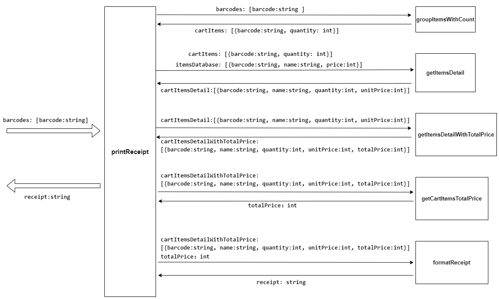

### Tasking
1. 统计barcodes中每种item数量 groupItemsWithCount
   - 输入：barcodes: [barcode:string ]
   - 输出：cartItems: [{barcode:string, quantity: int}]
2. 获取每个item的信息 getItemsDetail
   - 输入：
      - cartItems: [{barcode:string, quantity: int}]
      - itemsDetail: [{barcode:string, name:string, price:int}]
   - 输出：cartItemsDetail:[{barcode:string, name:string, quantity:int, unitPrice:int}]
3. 计算每种item的总价 getItemsDetailWithTotalPrice
   - 输入：cartItemsDetail:[{barcode:string, name:string, quantity:int, unitPrice:int}]
   - 输出：cartItemsDetailWithTotalPrice:[{barcode:string, name:string, quantity:int, unitPrice:int, totalPrice:int}]
4. 计算所有商品的总价 getCartItemsTotalPrice
   - 输入：cartItemsDetailWithTotalPrice:[{barcode:string, name:string, quantity:int, unitPrice:int, totalPrice:int}]
   - 输出：totalPrice：int
5. 格式化现有数据 formatReceipt
   - 输入：
     - cartItemsDetailWithTotalPrice:[{barcode:string, name:string, quantity:int, unitPrice:int, totalPrice:int}]
     - totalPrice: int
   - 输出：receipt: string
6. 输出数据
   - 输入: receipt:string
   - 输出: ouput to console
  
#### Context map

#### PDCA

1. 
| | groupItemsWithCount |
---|---
Plan | 8min
Do | 15min
Check| 对javascript对象或数组的一些api不熟悉, 思考如何遍历统计比较优
Action| 去查找js关于对象或数组的api文档，练习一下

2. 
| | getItemsDetail |
---|---
Plan | 8min
Do | 11min
Check| 在考虑除了使用双重循环结构，是否还有别的更优的方法来将购物车上的商品匹配到数据库中商品的详情
Action| 思考一下更优的方法

3. 
| | getItemsDetailWithTotalPrice |
---|---
Plan | 5min
Do | 5min
Check| 在构造新的item对象时候有一些字段名写错
Action| 尽量使用复制的方式

4. 
| | getCartItemsTotalPrice |
---|---
Plan | 3min
Do | 2min
Check| 通过遍历数组累加求所有商品总价，这里没遇到障碍
Action| none

5. 
| | formatReceipt |
---|---
Plan | 8min
Do | 8min
Check| 这一步容易遗漏一些需要输出的内容以及一些空格之类的字符
Action| 多使用\`${}\` 这种模板字符串，要注意输出案例的各种符号如换行符